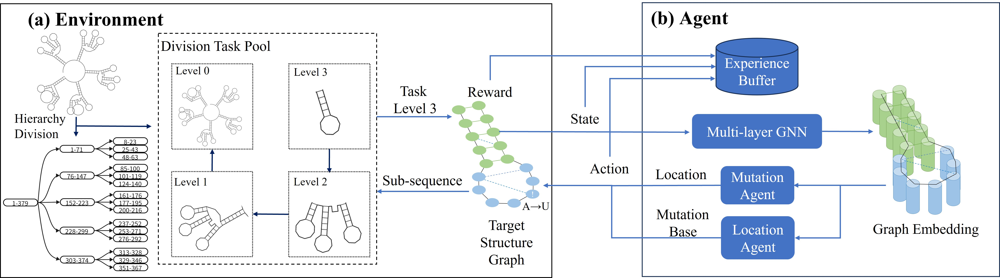

# DRAG: Design RNAs as Hierarchical Graphs with Reinforcement Learning
In this repository, we provide the code accompanying our publication
> DRAG: Design RNAs as Hierarchical Graphs with Reinforcement Learning
> Yichong Li, Xiaoyong Pan, Hongbin Shen, Yang Yang


**Figure 1**: The framework of DRAG. (a) The design environment with task division. (b) The agent based on GNNs. A target RNA secondary structure is decomposed and forms a division task pool.

DRAG is an RL method that builds design environments for target secondary structures with hierarchical division based on graph neural networks. It is capable of designing RNA sequences that satisfy given structural needs.

---
## Requirements
The following software is required to run our code:
- Python version 3.7 or higher
- ViennaRNA (recommended version: 2.5.0a5)
- pytorch version 1.10.1
- torch-geometric
- numpy
- gym
- tqdm
- wandb
- psutil
- pathos
- distance
- pyecharts

The required operating system: Ubuntu 16.04.5 LTS

## Datasets
### Rfam-train,Rfam-taneda and Eterna100 v1
These datasets are sourced from [Runge et al.,2019](https://arxiv.org/abs/1812.11951), Frank Hutter. You can access the original dataset [here](https://github.com/automl/learna/tree/master).


### Eterna100 v2
Eterna100 V2 is sorted in `./data/eterna_v2/` within the project directory.


## Usage
We provide commands to reproduce our results for single target structures of any of the benchmarks, instead of providing a pipeline that directly involves entire datasets. The following commands will run one of the finally selected configurations on a single target structure.

```bash
./design.sh
Enter the target structure:
<Target structure. For example: ((((((.((((....))))))).)))..........>
Enter the version of RNAfold(1 or 2):
<RNAfold version. For example: 2>
```
